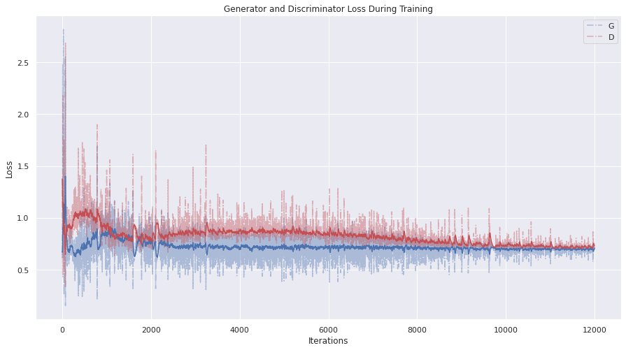
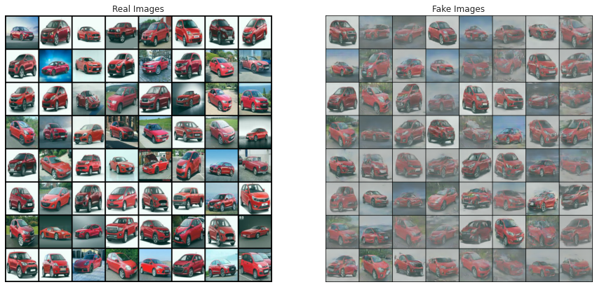

# Generative-Adversarial-Network-GAN

## Dataset
‪[Dataset](assets/car_dataset.png)

The dataset was created with 1463 images of red cars collected from internet.

The original Original CAR dataset is hosted on Amazon S3. It can be downloaded from following URL
https://datasets-sgm.s3.eu-west-3.amazonaws.com/car_images.zip

The original Processed CAR dataset (size = 100 x 100) is hosted on Amazon S3. It can be downloaded from following URL
https://datasets-sgm.s3.eu-west-3.amazonaws.com/car_images_100x100.zip

#
## Training
Here, used `spectral_norm` instead of the normal batch_norm2d, Please refer this paper [Spectral Normalization for Generative Adversarial Networks](https://arxiv.org/abs/1802.05957)

#
## Loss

#
## Visualization of Generator's progression

#
## Real Images vs. Fake Images

